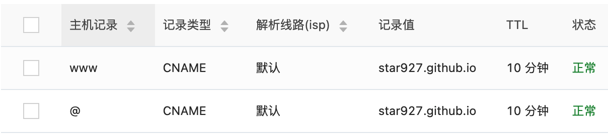

# GitHub Pages绑定个人域名

<!--more-->

## 购买域名

如阿里云、腾讯云、华为云等都可以购买域名，同一个域名不同厂商的价格可能不一样。

## 域名解析

以阿里云为例，进入`域名控制台`，解析新购买的域名。添加下面两条记录，记录值填写Github Pages的原始域名`user-name.github.io`，记录类型选择`CNAME`，比如自己的域名是`huxinme.top`，那么主机记录`www`对应的网址就是`www.huxinme.top`，主机记录`@`对应的网址是`huxinme.top`。添加完两条记录后，需等待十几分钟。

## Github Pages绑定个人域名

进入自己博客对应的仓库，打开【Settings】-【 Pages】， 在`Custom domain`下填写自己的域名后点击`Save`，`Enforce HTTPS`选项可以勾选上，强制使用`HTTPS`。

> 点击`Save`后可能提示绑定不成功，十几分钟后再试一下即可，域名解析需要等待一定的时间。

---

> 作者: [Huxley](https://huxinme.top)  
> URL: https://huxinme.top/posts/blog/github-custom-domain/  

