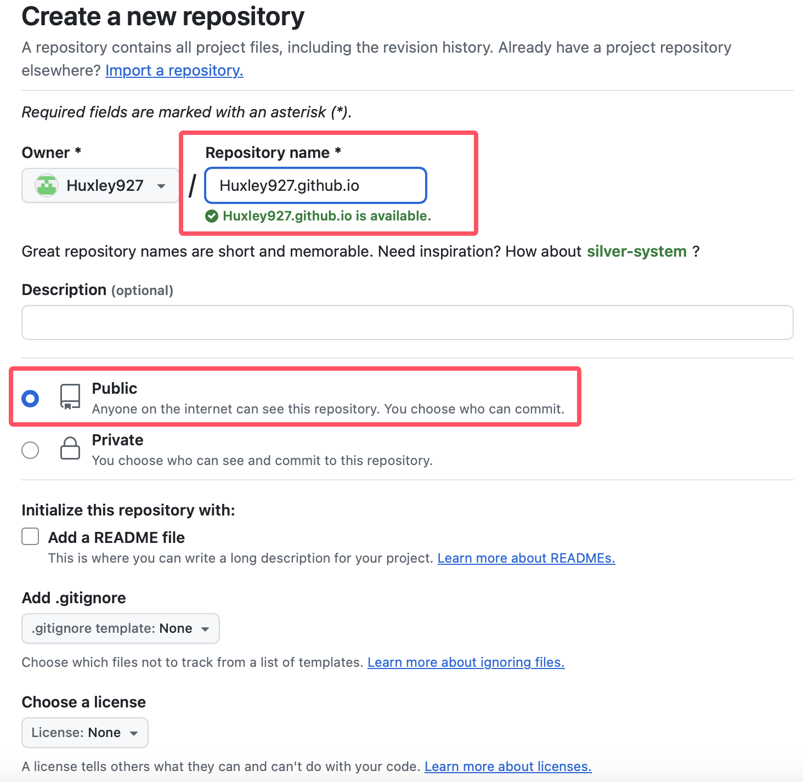
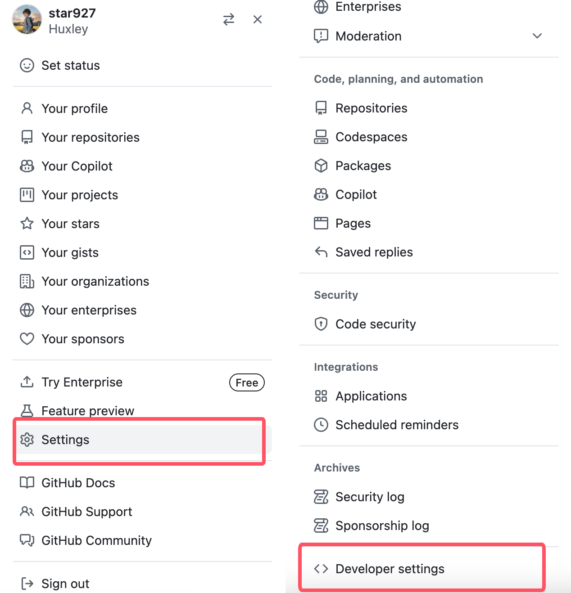
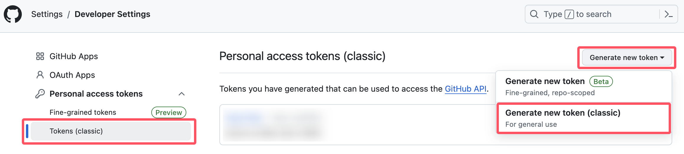
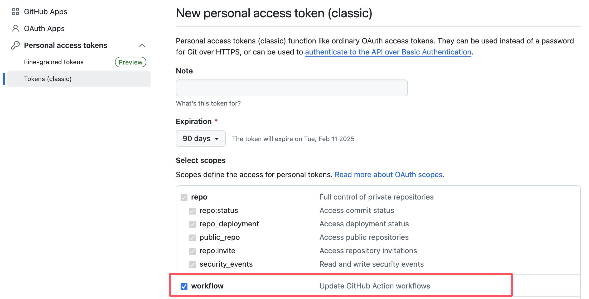
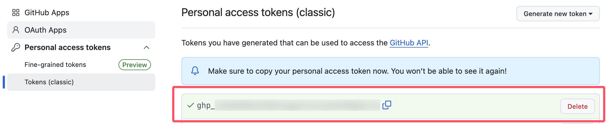
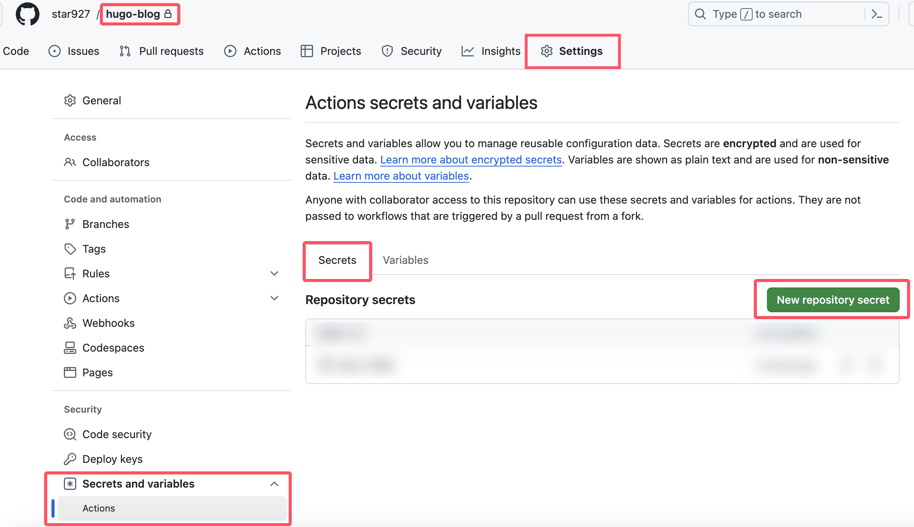
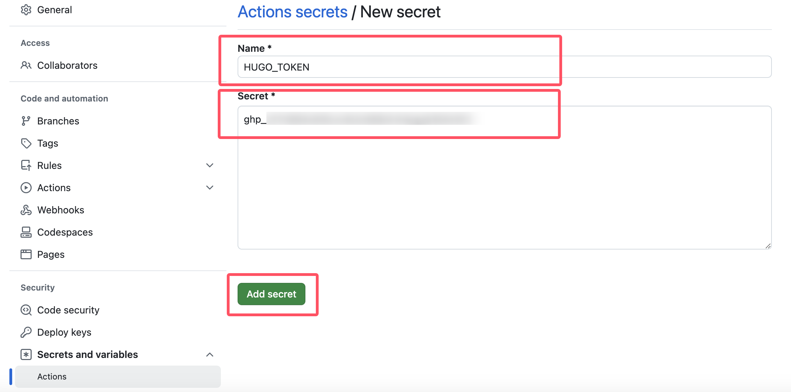

# Hugo &#43; Github Pages搭建个人博客


使用Hugo搭建个人博客，并部署到Github Pages上。

&lt;!--more--&gt;

## 安装Hugo等软件

参考[Hugo官网安装说明](https://gohugo.io/installation/)，必要软件包括：[Hugo](https://gohugo.io/installation/macos/)，[Go](https://go.dev/doc/install)，[Git](https://git-scm.com/downloads/mac)。

Mac用户可直接使用[Homebrew](https://brew.sh/)进行安装

```shell
brew install hugo
brew install go
brew install git
```

## 在本地创建博客

### 初始化博客

下述命令将新建一个名为`Blog`的文件夹（可以自定义改成其他名字，下文中该文件夹统一都用`Blog`这个名称），该文件夹用于存放博客的所有文件。进入到新建的`Blog`文件夹中，进行Git初始化。

```shell
hugo new site Blog
cd Blog
git init
```

使用`git submodule add`命令下载主题到`themes`文件夹中，并在配置文件`hugo.toml`中指定使用的主题的名称，更多主题参考[Hugo官网](https://themes.gohugo.io/)和[Github](https://github.com/topics/hugo-theme)。下述命令下载了一个主题放在了`themes/ananke`路径下，并在`hugo.toml`中指定了`theme`的值为`ananke`。

&gt; [!Note]
&gt; 主题的名称可以自定义，例如下述命令中可以将`ananke`替换成其他名称。可以安装多个主题，但应注意`hugo.toml`文件中`theme`的值应该是`themes`文件夹下的某个文件夹的名称。


```
git submodule add https://github.com/theNewDynamic/gohugo-theme-ananke.git themes/ananke
echo &#34;theme = &#39;ananke&#39;&#34; &gt;&gt; hugo.toml
```

最后在`Blog`路径下运行下述命令，即可在本地运行博客，默认端口是`1313`，打开网址`http://127.0.0.1:1313`即可预览博客，具体使用的端口详见命令的输出结果。`-D`与`--buildDrafts`等效，作用是会显示草稿文章。

```
hugo server
hugo server -D
hugo server --buildDrafts
```

### 新增博客文章

在`Blog`路径下执行下述命令，将新建文件`content/posts/my-first-post.md`，可将所有后续的所有博客文章都放在`content`下的`posts`文件夹中。

```
hugo new content/posts/my-first-post.md
```

&gt; [!Note]
&gt;
&gt; 默认生成的文章，可以在文章头看到`draft`为`true`，即为草稿文章，一般发布网站时不发布草稿文章，因此对于要发布的文章，需将`draft`值改成`false`或者直接删除文章头中`draft`这一行配置。

## 创建Github Pages

创建一个仓库，名称为`&lt;username&gt;.github.io`，比如用户名是`Huxley927`，那么该仓库的名称应该是`Huxley927.github.io`；并且仓库为`Public`类型，如下图：



在后续将博客网站的文件上传到该仓库后，`&lt;username&gt;.github.io`就是自己博客的网址。

## 发布网站

&gt; [!Note]
&gt;
&gt; [手动发布网站](#手动发布网站)的方法可行，但推荐下文提到的[用Github Actions自动发布网站](#用github-actions自动发布网站)，先了解手动发布网站的过程，再看如何用Github Actions自动发布网站

### 手动发布网站

在`Blog`路径下运行`hugo`命令将会生成静态博客网站，网站的文件在都在`public`文件夹中。

```
hugo
```

&gt; [!Tip]
&gt;
&gt; 进入到`public`文件夹，比如可以用`python -m http.server`命令即可运行一个本地服务器，运行下述命令后就可以在浏览器中打开`127.0.0.1:1313`看到Hugo生成的博客
&gt;
&gt; ```
&gt; cd public
&gt; python -m http.server 1313
&gt; ```

将`public`文件夹上传到上述创建的`&lt;username&gt;.github.io`仓库中，首次提交到Github上，在`public`文件中需运行以下命令：

```shell
git init
git add .
git commit -m &#34;first commit&#34;
# &lt;username&gt;替换成自己的用户名
git remote add origin git@github.com:&lt;username&gt;/&lt;username&gt;.github.io.git
git push -u origin main
```

&gt; [!Note]
&gt;
&gt; 需先配置好[Github SSH](../../notes/github-ssh)

以后每次本地博客有修改后，按照以下步骤更新网站：

1. 在`Blog`路径下（即上面创建的博客所对应的文件夹）下执行`hugo`命令
2. 进入到`public`文件夹下，将`public`文件夹中的内容提交到Github上的`&lt;username&gt;.github.io`仓库中

上述两个步骤是每次更新网站的必要步骤。但是最好还是再创建一个Github仓库（可设置成私有仓库），比如取名为`hugo-blog`，用来存放博客的所有文件，这样的话，以后每次本地博客有修改后，需完成的事项有：

- 在`Blog`路径下中执行`hugo`命令，并将`public`文件夹的内容提交到`&lt;username&gt;.github.io`仓库中。（即上面提到的两个步骤）
- 将`Blog`文件夹提交到`hugo-blog`仓库中

### 用Github Actions自动发布网站

相较于手动发布网站，用Github Actions自动发布网站达成的效果是，每次需更新网站时，只需将`Blog`文件夹上传到`hugo-blog`仓库中，之后Github自动就会更新`&lt;username&gt;.github.io`仓库中的内容，无需手动将`public`文件夹上传到`&lt;username&gt;.github.io`仓库中。

#### 创建access tokens

打开Github网页，点击右上角个人头像，进入`Settings`界面，点击设置列表中的`Developer settings`



点击`Personal access tokens`下的`Tokens(classic)`，然后点击`Generate new token`下的`Generate new token(classic)`



生成access token时，勾选`workflow`



最后点击页面下方的`Generate token`按钮即可。生成完成后如下图，将生成的`access token`复制下来，以后这个`aceess token`将不可见。



#### 创建Actions Secret

进入到上面提到的`hugo-blog`仓库，依次点击`Settings`、`Secrets and Variables`、`Actions`、`New repository secret`



如下图，输入`Name`和`Secret`，`Name`可自定义，这里取名为`HUGO_TOKEN`，`Secret`即为上面生成的`access token`。



最后点击`Add secret`完成。

#### 创建Github Action

在`.github/workflows`文件夹下创建一个`yaml`文件，比如`.github/workflows/hugo_deploy.yaml`，文件的内容如下：

```yaml {title=&#34;.github/workflows/hugo_deploy.yaml&#34;}
name: GitHub Pages

on:
  push:
    branches:
      - main
  pull_request:

jobs:
  deploy:
    # 这里指定ubuntu为最新版本, 使用指定版本也可, 比如 ubuntu-22.04
    runs-on: ubuntu-latest
    concurrency:
      group: ${{ github.workflow }}-${{ github.ref }}
    steps:
      - uses: actions/checkout@v4
        with:
          submodules: true
          fetch-depth: 0

      - name: Setup Hugo
        uses: peaceiris/actions-hugo@v3
        with:
          # 运行hugo version可以查看本地hugo版本
          # 这里使用最新版本的hugo, 也可写具体的版本号, 与本地hugo版本保持一致, 比如 0.138.0
          hugo-version: latest
          # 查看hugo version的结果，如果本地是extended版本，就设置成true，反之设置成false
          extended: true

      - name: Build
        run: hugo  # 命令可以修改，比如草稿文章也想发表可改成hugo -D

      - name: Deploy
        uses: peaceiris/actions-gh-pages@v3
        if: github.ref == &#39;refs/heads/main&#39;
        with:
          # HUGO_TOKEN就是上面Actions Secret取的名字，要与自己取的名字保持一致
          personal_token: ${{ secrets.HUGO_TOKEN }}
          # &lt;username&gt;替换成自己的用户名
          external_repository: &lt;username&gt;/&lt;username&gt;.github.io
          # 现在默认分支都用main，比如用的是master分支，则改为master
          publish_branch: main
          publish_dir: ./public
          # 可选配置, 每次博客更新后, 本仓库会自动往&lt;username&gt;.github.io仓库提交一次更新后的网站内容
          # 添加该项配置后, &lt;username&gt;.github.io仓库的提交信息就会使用本仓库的提交信息
          commit_message: ${{ github.event.head_commit.message }}
          cname: https://huxinme.top  # 填写自己的自定义域名, 如果没有自定义域名, 删除该项配置
```

#### 发布网站

`public`和`resources`文件夹都是Hugo生成静态网站时创建的，因此在`.gitignore`文件中可以添加以下内容

```{title=&#34;.gitignore&#34;}
.hugo_build.lock
/public/
/resources/  # hugo生成的文件，也可忽略
```

最后，将`Blog`文件夹提交到`hugo-blog`仓库中即可，首次提交到Github上，用到的命令如下

```shell
git add .
git commit -m &#34;first commit&#34;
# &lt;username&gt;替换成自己的用户名，hugo-blog时自己取的仓库的名称
git remote add origin git@github.com:&lt;username&gt;/hugo-blog.git
git branch -M main
git push -u origin main
```

提交到Github上后，稍等一会儿，打开`&lt;username&gt;.github.io`就可以看到更新后的网站了。

## 进一步的配置

- [GitHub Pages绑定个人域名](../github-custom-domain/)

## 参考资料

- [将Hugo静态网站部署到Github Pages](https://simumis.com/posts/deploy-to-github/)
- [actions-hugo](https://github.com/peaceiris/actions-hugo)


---

> 作者: [Huxley](https://huxinme.top)  
> URL: https://huxinme.top/posts/blog/hugo-blog/  

