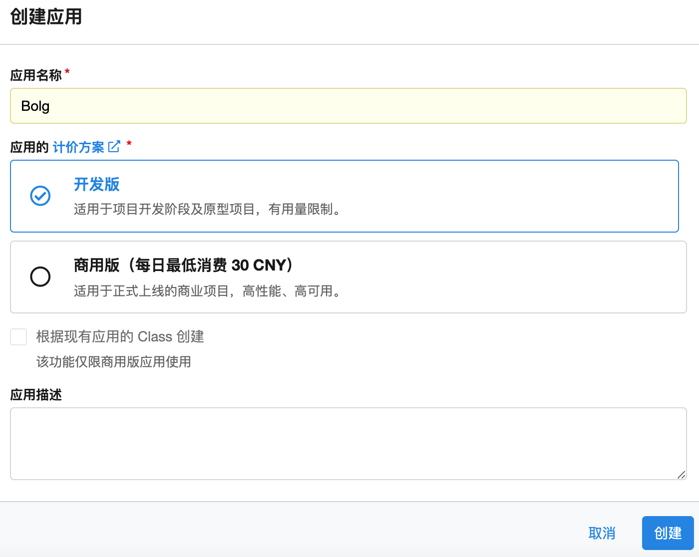
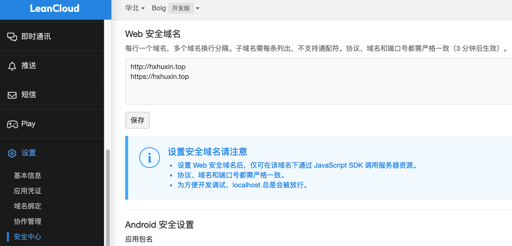
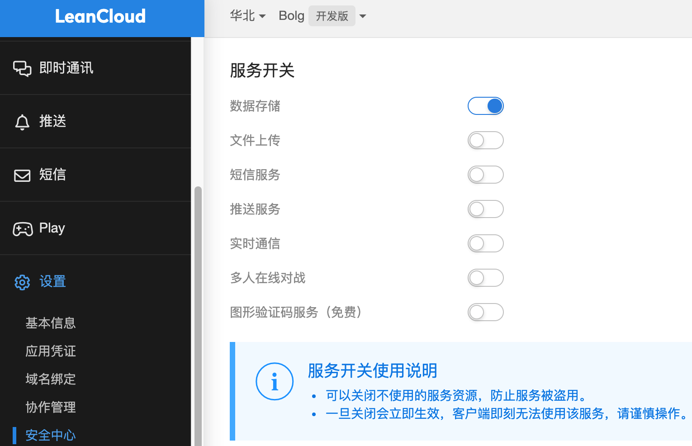

# Jekyll博客中基于LeanCloud统计文章阅读量


<!--more-->

## 配置LeanCloud

- 进入LeanCloud官网<https://www.leancloud.cn/>，注册或登录账号。

- 创建应用，应用名称可自行设定。



- 创建Class，【数据存储】-【结构化数据】-【创建Class】，Class名称与后面相关代码有关，为减少不必要的麻烦，建议将Class名称设置为`Counter`，其它设置项默认值即可。


以后每篇文章的点击量等信息都可在该Class下查看。

- 设置安全域名，【设置】-【安全中心】-【Web安全域名】，填写自己博客的域名即可，在本地调试阶段还可以添加`http://127.0.0.1:4000`



- 查看`App ID`和`App Key`，【设置】-【应用凭证】-【Credentials】，`App ID`和`App Key`在后面的配置中会用到。


- 安全设置，【设置】-【安全中心】-【服务开关】，由于`App ID`和`App Key`会出现在博客的配置文件中，相当于是公开的，所以有必要进行安全设置，关闭不需要的服务。



## 修改博客配置文件

需要修改或新增的文件如下：

```
.
├── _config.yml
├── _includes
│   └── leancloud-analytics.html
└── _layouts
    ├── default.html
    └── post.html
```

### _config.yml

```yml
leancloud:
  enable: true 
  app_id: xxxxxx 
  app_key: xxxxxx
```

`enable`是一个总开关，控制LeanCould统计功能是否开启，`app_id`和`app_key`对应LeanCloud的`App ID`和`App Key`

### leancloud-analytics.html

创建`leancloud-analytics.html`文件，放在`_includes`文件夹下，代码如下：

> 代码参考于<https://blog.csdn.net/u013553529/article/details/63357382>

```html
<script src="https://cdn.jsdelivr.net/npm/jquery@3/dist/jquery.min.js"></script>
<script src="https://cdn1.lncld.net/static/js/av-core-mini-0.6.1.js"></script>
<script>AV.initialize("{{site.leancloud.app_id}}", "{{site.leancloud.app_key}}");</script>
<script>
  function showHitCount(Counter) {
    var query = new AV.Query(Counter);
    var entries = [];
    var $visitors = $(".leancloud_visitors");

    $visitors.each(function () {
      entries.push( $(this).attr("id").trim() );
    });

    query.containedIn('url', entries);
    query.find()
      .done(function (results) {
        var COUNT_CONTAINER_REF = '.leancloud-visitors-count';

        if (results.length === 0) {
          $visitors.find(COUNT_CONTAINER_REF).text(0);
          return;
        }

        for (var i = 0; i < results.length; i++) {
          var item = results[i];
          var url = item.get('url');
          var hits = item.get('hits');
          var element = document.getElementById(url);

          $(element).find(COUNT_CONTAINER_REF).text(hits);
        }
        for(var i = 0; i < entries.length; i++) {
          var url = entries[i];
          var element = document.getElementById(url);
          var countSpan = $(element).find(COUNT_CONTAINER_REF);
          if( countSpan.text() == '') {
            countSpan.text(0);
          }
        }
      })
      .fail(function (object, error) {
        console.log("Error: " + error.code + " " + error.message);
      });
  }

  function addCount(Counter) {
    var $visitors = $(".leancloud_visitors");
    var url = $visitors.attr('id').trim();
    var title = $visitors.attr('data-flag-title').trim();
    var query = new AV.Query(Counter);

    query.equalTo("url", url);
    query.find({
      success: function(results) {
        if (results.length > 0) {
          var counter = results[0];
          counter.fetchWhenSave(true);
          counter.increment("hits");
          counter.save(null, {
            success: function(counter) {
              var $element = $(document.getElementById(url));
              $element.find('.leancloud-visitors-count').text(counter.get('hits'));
            },
            error: function(counter, error) {
              console.log('Failed to save Visitor num, with error message: ' + error.message);
            }
          });
        } else {
          var newcounter = new Counter();
          /* Set ACL */
          var acl = new AV.ACL();
          acl.setPublicReadAccess(true);
          acl.setPublicWriteAccess(true);
          newcounter.setACL(acl);
          /* End Set ACL */
          newcounter.set("title", title);
          newcounter.set("url", url);
          newcounter.set("hits", 1);
          newcounter.save(null, {
            success: function(newcounter) {
              var $element = $(document.getElementById(url));
              $element.find('.leancloud-visitors-count').text(newcounter.get('hits'));
            },
            error: function(newcounter, error) {
              console.log('Failed to create');
            }
          });
        }
      },
      error: function(error) {
        console.log('Error:' + error.code + " " + error.message);
      }
    });
  }

  $(function() {
    var Counter = AV.Object.extend("Counter");
    if ($('.leancloud_visitors').length == 1) {
      /* in post.html, so add 1 to hit counts */
      addCount(Counter);
    }
  });
</script>
```

### default.html

将下面代码添加进`_layouts/default.html`文件中，这样每一篇博客中都会加载`leancloud-analytics.html`文件。

```liquid

  

```

### post.html

想在每篇博客中显示该篇文章的阅读量，可将下面代码添加在`_layouts/post.html`合适的位置。

```html

  <span>|</span>
  <i class="far fa-eye"></i>
  <span id="{{ page.url }}" class="leancloud_visitors" data-flag-title="{{ page.title }}">
    <span class="leancloud-visitors-count"></span>
    <span class="post-meta-item-text">次阅读</span>
  </span>

```

效果图如下：


至此，LeanCloud统计功能配置完毕，登录LeanCloud打开上面创建的Class即可进行后台数据管理。


---

> 作者: [Huxley](https://huxinme.top)  
> URL: https://huxinme.top/posts/blog/jekyli-leancloud/  

