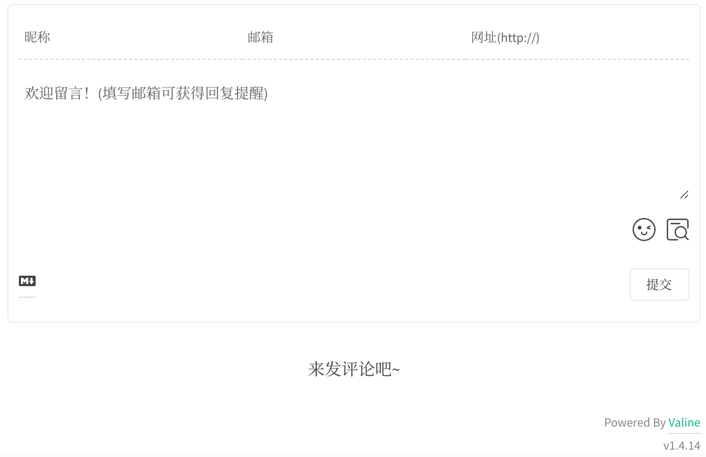
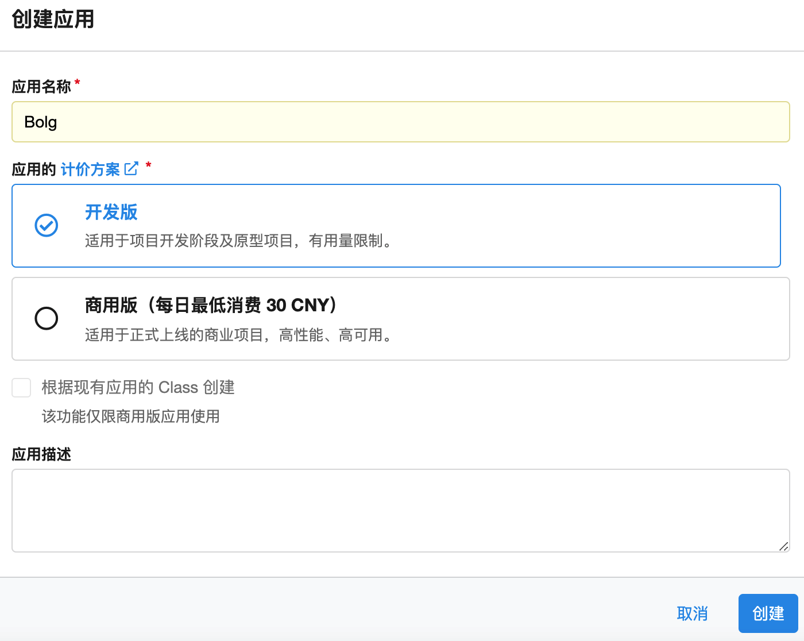
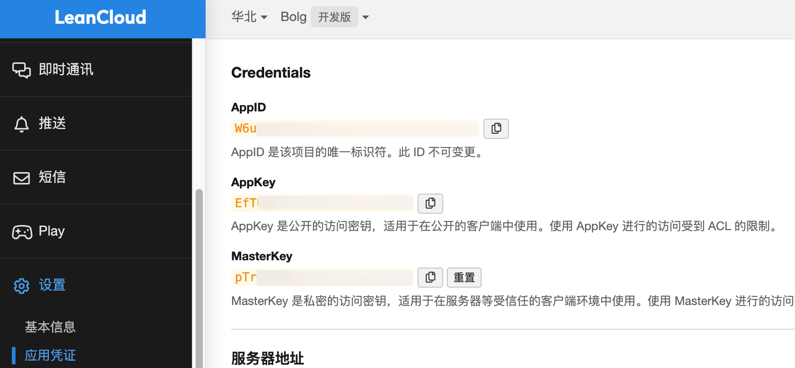
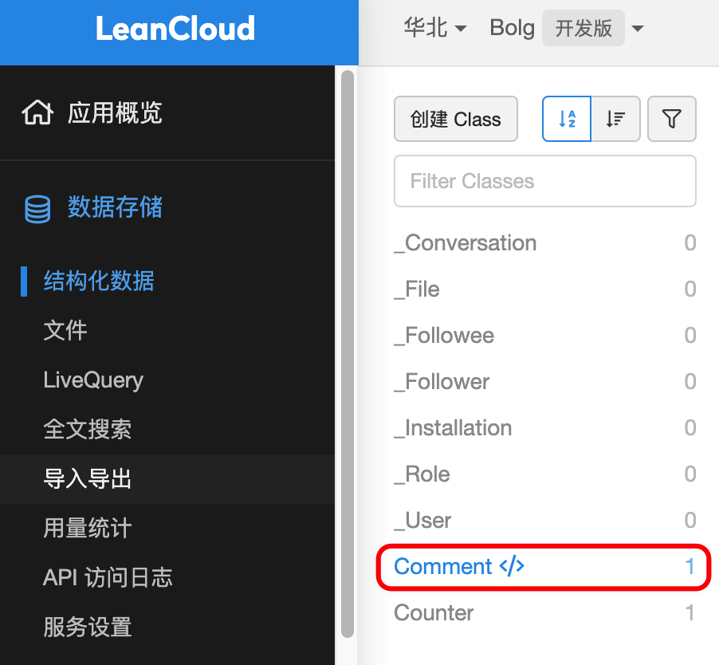

# Jekyll博客中添加Valine评论系统


<!--more-->

Valine评论系统的效果图如下：



下面一步步来配置Valine评论系统

## 配置LeanCloud

- 进入LeanCloud官网<https://www.leancloud.cn/>，注册/登录账号。

- 创建应用，应用名称可自行设定。



- 查看`App ID`和`App Key`，【设置】-【应用凭证】-【Credentials】，`App ID`和`App Key`在后面的配置中会用到。



## 修改博客配置文件

- 在`_config.yml`文件中添加以下代码：

```yml
valine:
  enable: true
  app_id: xxxxxx
  app_key: xxxxxx
```

`enable`是一个总开关，控制Valine评论功能是否开启，`app_id`和`app_key`对应LeanCloud的`App ID`和`App Key`。
更多配置项参见官方文档：<https://valine.js.org/configuration.html>

- 创建`valine.html`文件，放在`_includes`文件夹下，代码如下：

```html
<script src='//unpkg.com/valine/dist/Valine.min.js'></script>
<div id="vcomments"></div>
<script>
    new Valine({
        el: '#vcomments',
        appId: '{{ site.valine.app_id }}',
        appKey: '{{ site.valine.app_key }}',
    })
</script>
```

- 在需要添加Valine评论的地方添加以下代码，如`_layouts/post.html`文件

```liquid

  

```

至此Valine评论系统配置完毕。打开对应的LeanCloud应用，在【数据存储】-【结构化数据】-【Comment</>】中可查看和管理所有评论数据。



## 配置Valine邮件提醒功能

详见<https://github.com/DesertsP/Valine-Admin>


---

> 作者: [Huxley](https://huxinme.top)  
> URL: https://huxinme.top/posts/blog/jekyll-valine/  

