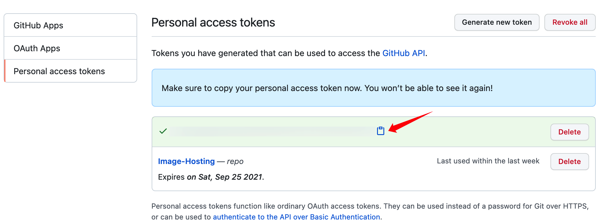
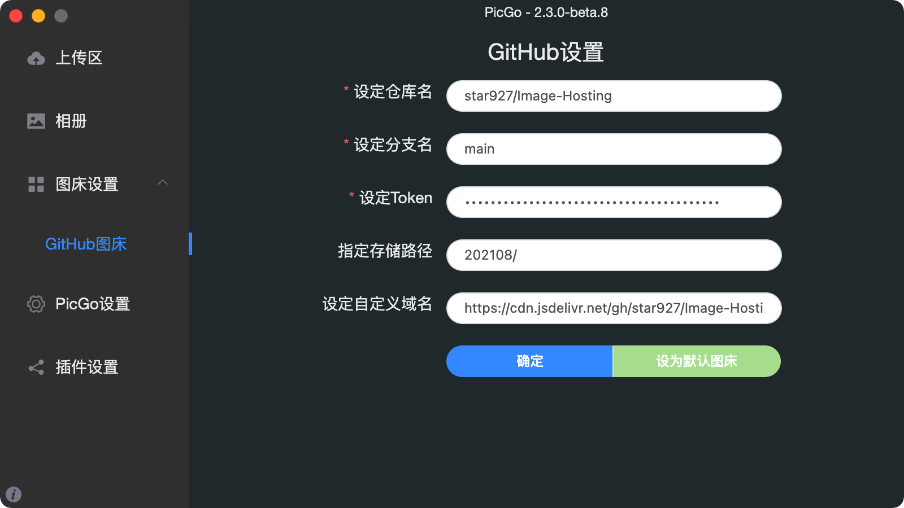

# GitHub+jsDelivr+PicGo搭建免费图床

<!--more-->

## 生成一个Github Token

进入Github主页，点击右上角个人头像，【Settings】-【Developer settings】-【Personal access tokens】-【Generate new token】，如下图：

`Note`可自定义，勾选`repo`。生成Token后，复制Token，之后该Token将不可见，如下图：

## 配置PicGo

[PicGo](https://github.com/Molunerfinn/PicGo)安装完成后，打开图床设置，配置GitHub图床，如下图：

> Tips: Mac系统打开PicGo后并不会看到PicGo的主界面，在菜单栏中找到PicGo图标，右键点击“打开详细窗口”即可打开PicGo主界面。

- 设定仓库名：格式是`用户名/仓库名`，可以新建一个GitHub仓库，专门用作图床
- 设定分支名：默认分支main即可
- 设定Token：复制刚刚生成的Token到此处
- 指定储存路径：如果不填，则之后图片会上传到仓库的根目录下，也可以指定存储路径（路径最后要加`/`）
- 设定自定义域名：基于jsDelivr搭建图床，则域名格式为：<https://cdn.jsdelivr.net/gh/user/repo@version>，如<https://cdn.jsdelivr.net/gh/star927/Image-Hosting@main>，设置完成后，即可通过<https://cdn.jsdelivr.net/gh/user/repo@version/file>格式访问文件了，如<https://cdn.jsdelivr.net/gh/star927/Image-Hosting@main/202108/PicGo.png>

配置完PicGo后，之后就可以通过PicGo快速将图片上传至GitHub仓库了。图片成功上传后，PicGo会自动将图片链接复制到粘贴板。PicGo常用的操作是：选定需要上传的图片，`Command+C`复制图片；`Command+Shift+P`上传刚刚复制的图片，`Command+V`获得图片链接。更多PicGo操作可自行探索。

---

> 作者: [Huxley](https://huxinme.top)  
> URL: https://huxinme.top/posts/blog/jsdelivr-image-hosting/  

