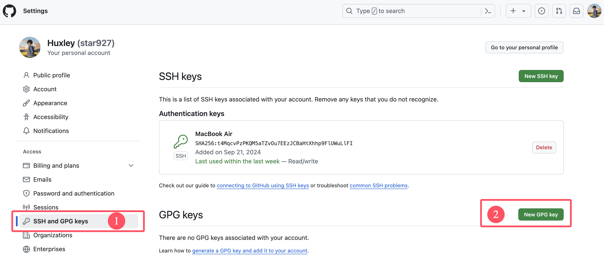
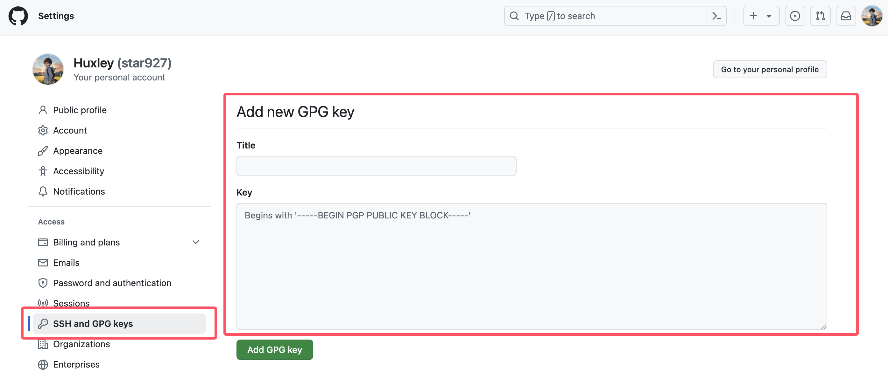

# Github使用GPG对Commit进行签名


如何使用GPG对Commit进行签名，并配置Github。

<!--more-->

## 概述

使用GPG，可以在本地对提交进行签名。这些提交在GitHub上标示为已验证，便于其他人信任更改来自可信的来源，如下图，在Github中可看到`Verified`标记。


## 配置步骤

### 安装 GPG

`macOS`可使用`homebrew` 进行安装

```-
brew install gpg
```

> [!Note]
> 下述步骤基于`gpg (GnuPG) 2.4.5;`

### 生成GPG密钥对

```
gpg --full-generate-key
```

该命令会提示指定密钥类型、密钥大小、密钥有效时长，默认值即可。命令结果示例如下

```
[keyboxd]
---------
sec   ed25519/39395E89396199AD 2024-09-22 [SC]
      D0A0C14574AD709997634CE439395E89396199AD
uid                   [ 绝对 ] Huxley <1469025384@example.com>
ssb   cv25519/1823F843E3B49C5F 2024-09-22 [E]
```

其中`39395E89396199AD`即为私钥，`1823F843E3B49C5F`即为公钥。

```shell
gpg --armor --export <私钥id>
```

再运行该命令即可看到以`-----BEGIN PGP PUBLIC KEY BLOCK-----`开头、以`-----END PGP PUBLIC KEY BLOCK-----`结尾的一段内容。

> [!Note]
> 要求你输入电子邮件地址时，请确保输入 GitHub 帐户的经过验证的电子邮件地址。

### 检查现有GPG密钥

```shell
gpg --list-secret-keys --keyid-format=long
```

该命令列出你拥有其公钥和私钥的长形式GPG密钥。

### Github中添加GPG密钥

在GitHub任意页的右上角，单击个人资料照片，然后单击`Settings`进入设置



在`SSH and GPK keys`设置中点击`New GPG key`



`Title`自定义取个名字，将`gpg --armor --export <私钥id>`的内容复制到`Key`中，保存。

### 将签名密钥告知 Git

```shell
git config --global --unset gpg.format
git config --global user.signingkey <私钥id>
```

若要将Git配置为默认对所有提交进行签名，请输入以下命令：

```
git config --global commit.gpgsign true
```

如没有配置该项，在`git commit -S`也可对提交进行签名

## 其他

### 删除GPG密钥对

```shell
gpg --delete-secret-keys  <私钥id>  # 删除私钥
gpg --delete-keys <公钥id>  # 删除公钥
```

先删除了私钥，才能删除公钥

### 修改GPG密码

```shell
gpg --edit-key <私钥id>
```

执行上述命令进入GPG命令行。在GPG命令行执行`passwd`命令可修改密码。

## 报错

> [!Failure]
> error: gpg failed to sign the data:
>
> gpg: signing failed: Inappropriate ioctl for device

直接在命令行或在终端配置文件(如`.zshrc`)中设置变量`GPG_TTY`

```shell
export GPG_TTY=$(tty)
```

> [!IMPORTANT]
>
> 如果使用了zsh的powerlevel10k主题，在zsh配置文件中`export GPG_TTY=$(tty)`可能会失效，打开终端输出`GPG_TTY`变量可能是`not a tty`。需要改成`export GPG_TTY=$TTY`，详见[not a tty when loading terminal with powerlevel10k #524](https://github.com/romkatv/powerlevel10k/issues/524)

## 参考

- [管理提交签名验证 - Github](https://docs.github.com/zh/authentication/managing-commit-signature-verification)


---

> 作者: [Huxley](https://huxinme.top)  
> URL: https://huxinme.top/posts/notes/github-gpg/  

