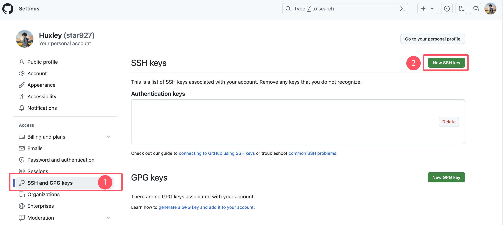
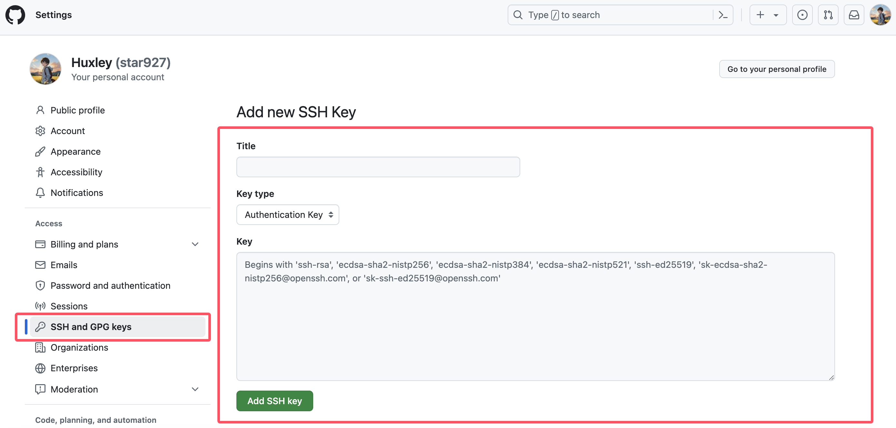

# Github上配置SSH


本文介绍了如何在Github上配置SSH，以及当有多个Github账号时又该如何进行配置。

&lt;!--more--&gt;

&gt; [!Note]
&gt;
&gt; 本文在于介绍与Github相关的SSH配置，关于SSH本身，比如SSH密钥的生成、本地SSH相关文件等，详见：[SSH Notes](../ssh)，本文不赘述。

## Github配置SSH

### 生成ssh密钥

运行`ssh-keygen`生成一个SSH密钥

```
ssh-keygen
```

生成的默认SSH私钥文件是`~/.ssh/id_ed25519`，对应的公钥文件是`~/.ssh/id_ed25519_pub`，后续需将公钥文件的内容粘贴到Github上。

### 在Github上配置SSH

在GitHub任意页的右上角，单击个人资料照片，然后单击`Settings`进入设置。


在`SSH and GPK keys`设置中点击`New SSH key`



`Title`自定义取个名字，`Key type`默认的`Authentication Key`即可，将本地的**公钥文件**的内容复制到`Key`中，保存。



## 报错

&gt; [!Failure]
&gt; ssh: connect to host github.com port 22: Operation timed out

在`SSH`的配置文件`~/.ssh/config`添加如下配置

```shell
Host github.com
HostName ssh.github.com
Port 443
```

## 多个Github账号配置SSH

当自己有多个Github账号，在一台电脑上同时用到这两个账号的仓库时，需要进行额外的配置。

### 生成多个SS密钥

一个Github账号需要生成一个SSH密钥，比如现在生成如下两个SSH密钥

```shell
ssh-keygen -f ~/.ssh/id_ed25519_github_alan
ssh-keygen -f ~/.ssh/id_ed25519_github_bob
```

### 将公钥添加到对应的Github账号

将生成的两个SSH公钥文件的内容分别添加到对应的Github账号上，见[上文](#在github上配置ssh)。

### 本地配置SSH

在SSH配置文件`~/.ssh/config`中添加以下内容：

```shell {title=&#34;~/.ssh/config&#34;}
Host github-alan
HostName github.com
User git
IdentityFile ~/.ssh/id_ed25519_github_alan

Host github-bob
HostName github.com
User git
IdentityFile ~/.ssh/id_ed25519_github_bob
```

如果遇到了上面提到的问题`ssh: connect to host github.com port 22: Operation timed out`，可将上述内容修改成下面内容：

```shell {title=&#34;~/.ssh/config&#34;}
Host github-alan
HostName ssh.github.com
User git
Port 443
IdentityFile ~/.ssh/id_ed25519_github_alan

Host github-bob
HostName ssh.github.com
User git
Port 443
IdentityFile ~/.ssh/id_ed25519_github_bob
```

### 多个SSH密钥的使用

比如上述SSH密钥`~/.ssh/id_ed25519_github_alan`对应用户名为`alan`的Github账号，`~/.ssh/id_ed25519_github_bob`对应用户名为`bob`的账号，现在需要克隆`alan`和`bob`的仓库，在Github上复制仓库的地址后，一般使用的克隆仓库的命令分别如下：

```shell
git clone git@github.com:alan/alan.github.io.git
git clone git@github.com:bob/bob.github.io.git
```

那么，在进行上述配置后，现在命令应该分别修改成：

```shell
git clone github-alan:alan/alan.github.io.git
git clone github-bob:bob/bob.github.io.git
```

也就是将原来仓库地址中的`git@github.com`替换成上面`~/.ssh/config`文件中设置的对应SSH密钥的`Host`值。

### 更改本地远程仓库的地址

比如在原来本地某个仓库中运行命令`git remote -v`，得到的结果如下：

```shell
origin git@github.com:alan/hugo-blog.git (fetch)
origin git@github.com:alan/hugo-blog.git (push)
```

由于上面对SSH配置文件进行了修改，需要使用下面的命令更改远程仓库的地址：

```shell
git remote set-url origin github-alan:alan/hugo-blog.git
```

这样的话，这个仓库后续使用的SSH密钥就是`~/.ssh/id_ed25519_github_alan`


---

> 作者: [Huxley](https://huxinme.top)  
> URL: https://huxinme.top/posts/notes/github-ssh/  

